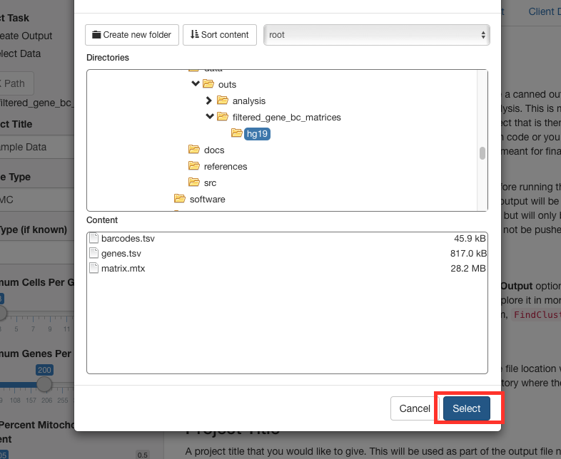

### Select Input Source

#### Create Output

When this is selected you have the option to input a 10X Path to create
a canned output that follows this [seurat
tutorial](http://satijalab.org/seurat/pbmc3k_tutorial.html) but uses
your input data to generate the analysis. This is meant to give a
starting point for further exploration. It also creates a Seurat object
that is then saved to be accessed later for any exploration. This can be
done using your own code or you can use the other part of this app to
explore the data in more detail. This is not meant for final analysis,
but just as a starting point.

There are initial input filters that you can choose for some basic QC
before running the canned report output. These filters will be described
in more detail below. The output will be placed in the output folder for
you to use. This repository will be tracked on
[github](https://github.com/kdgosik/SecondaryAnalysisCellRanger) but
will only be for the program's code only. All data and output files
created by using this will not be pushed to the repository. The output
is an html file that will be placed in the docs folder after you press
Create Object. It will have your project title, tissue type and cell
type in the file name

#### Select Data

The Select Data option assumes that you have already run the **Create
Output** option from above. This will allow you to load in the object
that was created and explore it in more detail. It will already have PCA
and tSNE run with the Seurat clustering algorithm,
<code>FindClusters</code>

### 10X Path

This button allows you to explore the file system in order to point to
the file location where the cell ranger output was placed. It is
expecting to be pointed to the directory where the gene and barcode
matrix is located. (e.g. ../outs/filtered\_gene\_bc\_matrices/hg19)

### Project Title

A project title that you would like to give. This will be used as part
of the output file name as well as part of the data object name that
will be used later on.

### Tissue Type

Tissue type is an optional input. It will be used to further identify
the output and data objects by being part of the file names.

### Cell Type

Cell type is an optional input. It will be used to further identify the
output and data objects by being part of the file names.

### Minimum Cells Per Gene

QC parameter used when creating a seurat object. Only genes that show up
in a minimum of this many cells will be kept for the analysis. It is
defaulted to the value of 3.

### Minimum Genes Per Cell

QC parameter used when creating a seurat object. Only cells that have a
minimum of this many genes expressed will be kept for the analysis. It
is defaulted to a value of 200.

### Max Percent Mitochondrial Genes Present

The percent of mitochondrial genes are calculated and placed as meta
data in the seurat object in the tutorial. This is also used as a QC. It
is defaulted to a value of 5%.
